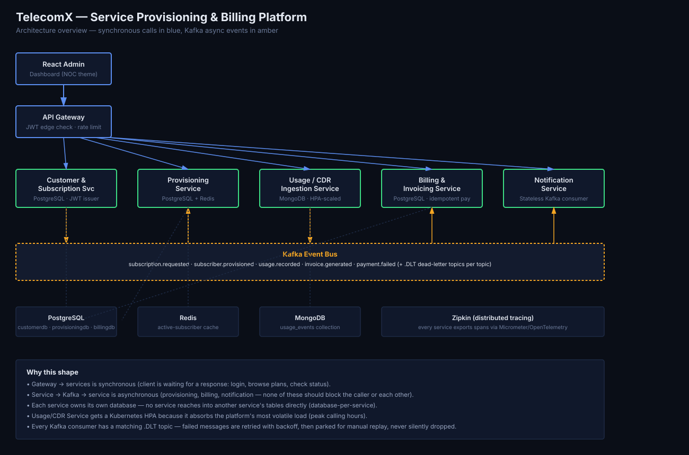
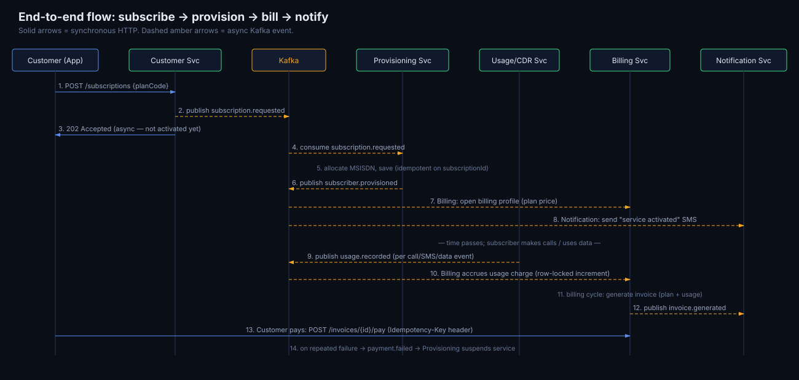

# TelecomX — Service Provisioning & Billing Platform

A telecom operator platform for subscriber onboarding, service provisioning, usage
metering, and billing — built as **6 independently deployable microservices**
communicating over **Kafka**, fronted by an **API Gateway**, with **polyglot
persistence** chosen deliberately per service rather than defaulting to one database
for everything.



> This is not a CRUD app wearing a microservices costume. Every technology below
> solves a specific problem this domain actually has — see the table in
> [§ Why this technology](#why-this-technology) for the reasoning behind each choice.

---

## Contents

- [Services](#services)
- [Why this technology](#why-this-technology)
- [Event-driven design](#event-driven-design--kafka-topics)
- [Idempotency, retries, dead-letter handling](#idempotency-retries-dead-letter-handling)
- [End-to-end flow](#end-to-end-flow)
- [Running locally](#running-locally)
- [API documentation](#api-documentation)
- [Testing](#testing)
- [Kubernetes](#kubernetes)
- [CI/CD](#cicd)
- [Project layout](#project-layout)

---

## Services

| Service | Responsibility | Database | Port |
|---|---|---|---|
| **api-gateway** | Single entry point, edge JWT check, routing, per-IP rate limiting | — | 8080 |
| **customer-service** | Registration/login (JWT issuer), plan catalog, subscription requests | PostgreSQL | 8081 |
| **provisioning-service** | Activates/suspends subscriber service, MSISDN allocation | PostgreSQL + Redis | 8082 |
| **usage-service** | Ingests call/SMS/data usage events (CDRs) | MongoDB | 8083 |
| **billing-service** | Aggregates usage + plan cost → invoices, processes payments | PostgreSQL | 8084 |
| **notification-service** | Sends SMS/email on activation, invoicing, payment failure | — (stateless) | 8085 |
| **admin-dashboard** | React ops console: service health, subscriber/billing actions, live notification feed | — | 3000 |

## Why this technology

| Technology | Used for | Why (not just resume-driven) |
|---|---|---|
| **PostgreSQL** | Customer/Subscription, Provisioning, Billing | These are transactional facts (a subscription, an MSISDN assignment, an invoice amount) that must be ACID and auditable. Eventually-consistent reads on billing math is not acceptable — you cannot "probably" charge someone the right amount. |
| **MongoDB** | Usage/CDR events | Usage events are high-volume, append-mostly, and shaped differently per type (a CALL has `durationSeconds`, a DATA event has `dataMb`). Forcing that into rigid relational tables means nullable-column sprawl or three tables with joins for something that's fundamentally a flat event stream — the natural fit for documents. |
| **Redis** | Provisioning's "is this subscriber active + which plan" cache | Checked on nearly every gated request; hitting Postgres for this on every call would be wasteful for data that's read constantly and changes rarely. Deliberately **not** used for anything transactional (no billing amounts) — that boundary is intentional. |
| **Kafka** | subscription → provisioning → billing → notification handoffs | Usage happens the instant a call ends, independent of whether billing is ready to process it. Coupling these synchronously means usage ingestion blocks on billing's availability (unacceptable — usage must never be dropped) and billing gets hammered by real-time spikes instead of processing at its own pace. |
| **Spring Security + JWT** | Auth across every service | customer-service issues tokens; every other service independently *validates* the same token as a stateless resource server. No service blindly trusts the gateway, and each stays independently testable/deployable. |
| **Idempotency keys** | Payment processing, provisioning activation | Kafka is at-least-once delivery, and clients retry timed-out requests. Without an idempotency ledger, a redelivered `usage.recorded` message or a retried `/pay` call could double-charge a subscriber. |
| **Kafka retry + DLT** | Every consumer | Downstream dependencies (DB, Redis) can be momentarily unavailable. Instead of blocking a partition forever or silently dropping a message, consumers retry with exponential backoff, then park the message in a `.DLT` topic for investigation/replay — usage and billing events are too important to just lose. |
| **Kubernetes HPA on usage-service only** | Autoscaling | Usage/CDR ingestion absorbs the platform's most volatile load (peak calling hours). The other services scale on fixed replica counts; only the genuinely spiky component gets an HPA — that's the actual textbook reason to autoscale, not "because Kubernetes can." |
| **Distributed tracing (Micrometer + Zipkin)** | Every service | A single "activate plan" request flows Gateway → Customer Service → Kafka → Provisioning → Kafka → Billing. Debugging a failure means following one trace ID across services, not grepping six separate logs. |
| **RFC 7807 Problem Details** | Global exception handling | One consistent error JSON shape (`type`, `title`, `status`, `detail`) across all 6 services, so the Gateway and React dashboard parse errors uniformly regardless of which service produced them. |

## Event-driven design & Kafka topics

| Topic | Producer | Consumer(s) | Why async |
|---|---|---|---|
| `subscription.requested` | customer-service | provisioning-service | A "subscribe" click shouldn't hang on SIM/number allocation, which can be slow. |
| `subscriber.provisioned` | provisioning-service | billing-service, notification-service | Downstream shouldn't block provisioning's response time. |
| `usage.recorded` | usage-service | billing-service | The highest-volume topic — usage spikes at peak hours must never overload billing synchronously. |
| `invoice.generated` | billing-service | notification-service | Notification delivery latency (SMS/email provider) must never slow down billing. |
| `payment.failed` | billing-service | notification-service, provisioning-service | Cross-service side effect (suspend after 3 failures) without coupling billing to provisioning's availability. |
| `*.DLT` | Kafka retry mechanism | manual/automated reprocessing | See below. |

## Idempotency, retries, dead-letter handling

- **Idempotency**: `provisioning-service` and `billing-service` both maintain an
  `idempotency_records` table. HTTP writes accept an `Idempotency-Key` header;
  Kafka consumers key off the event's natural ID (`subscriptionId`). A duplicate
  request/redelivery returns the cached result instead of re-executing business logic.
  See `BillingServiceTest` and `ProvisioningServiceTest` for tests that specifically
  assert a duplicate event does **not** create a duplicate record or double-charge.
- **Retry**: every Kafka consumer uses `DefaultErrorHandler` with an
  `ExponentialBackOff` (1s → 2s → 4s..., capped) for transient failures.
- **Dead-letter**: after retries are exhausted, `DeadLetterPublishingRecoverer` routes
  the message to `<topic>.DLT` instead of dropping it or blocking the partition
  forever. Ops can inspect and replay from there (Kafka UI is included in
  `docker-compose.yml` at `localhost:8090` for exactly this).

## End-to-end flow



## Running locally

**Prerequisites:** Docker + Docker Compose. Nothing else needs to be installed locally
— all builds happen inside the containers.

```bash
docker-compose up --build
```

This starts: Postgres, MongoDB, Redis, Kafka (+ Zookeeper), Kafka UI, Zipkin, all 6
microservices, the API Gateway, and the React dashboard.

| Component | URL |
|---|---|
| Admin dashboard | http://localhost:3000 |
| API Gateway | http://localhost:8080 |
| Kafka UI (inspect topics / DLTs) | http://localhost:8090 |
| Zipkin (distributed traces) | http://localhost:9411 |
| Swagger UI per service | `http://localhost:<port>/swagger-ui.html` |

**Try it end to end:**
1. Open the dashboard, register a customer.
2. Pick a plan — this fires `subscription.requested`; watch the subscription move
   to `ACTIVE` a moment later once Provisioning consumes the event.
3. Click **Simulate usage** to generate sample call/SMS/data events.
4. Click **Generate invoice**, then **Pay** (or **Fail** to see the payment-failed →
   suspend-signal flow — fail it 3 times and watch Provisioning suspend the service).
5. Watch the **Recent Notifications** panel update as each event fires.

## API documentation

Each service publishes OpenAPI/Swagger at `/swagger-ui.html`:
- customer-service: http://localhost:8081/swagger-ui.html
- provisioning-service: http://localhost:8082/swagger-ui.html
- usage-service: http://localhost:8083/swagger-ui.html
- billing-service: http://localhost:8084/swagger-ui.html

## Testing

- **Unit tests**: business logic with mocked repositories (e.g. `AuthServiceTest`,
  `BillingServiceTest`, `ProvisioningServiceTest` — the latter two specifically
  assert idempotent behavior on duplicate events).
- **Integration tests**: Testcontainers-based, spinning up real Postgres/Kafka in CI
  (see `pom.xml` test dependencies and `.github/workflows/ci-cd.yml`).

```bash
cd customer-service && mvn clean verify
```

## Kubernetes

Manifests are in [`/k8s`](k8s):

```bash
kubectl apply -f k8s/00-namespace.yaml
kubectl apply -f k8s/
```

Notable choices:
- `Deployment` + `Service` per microservice, each with `readinessProbe` /
  `livenessProbe` hitting Spring Actuator's `/actuator/health/readiness` and
  `/liveness` — a pod that's started but can't reach its DB won't receive traffic.
- **HPA only on `usage-service`** (see `12b-usage-service-hpa.yaml`) — it's the one
  component with genuinely volatile, spiky load.
- Infra (Postgres/Mongo/Redis/Kafka) is deployed as plain `Deployment`s for
  local/demo clusters only — a real production cluster would use managed services
  or proper StatefulSets/operators with persistent volumes and backups instead.
- Secrets are templated in `02-secret.yaml` — **never commit real values**; populate
  via `kubectl create secret` from your CI/vault in a real environment.

## CI/CD

`.github/workflows/ci-cd.yml`:
1. Matrix build + Testcontainers-backed `mvn verify` per service (parallel, independent).
2. Frontend build for the React dashboard.
3. Docker build + push to GHCR (main branch only, after tests pass).
4. Optional `kubectl apply` to a staging namespace if a `KUBE_CONFIG` secret is configured.

## Project layout

```
telecomx-platform/
├── api-gateway/              Spring Cloud Gateway, JWT edge filter, rate limiting
├── customer-service/         PostgreSQL, JWT issuer, plan catalog, subscriptions
├── provisioning-service/     PostgreSQL + Redis, idempotent activation, Kafka retry/DLT
├── usage-service/            MongoDB, CDR ingestion, usage simulator
├── billing-service/          PostgreSQL, invoice generation, idempotent payments
├── notification-service/     Stateless Kafka consumer, simulated SMS/email
├── admin-dashboard/          React (Vite) ops console
├── k8s/                      Deployments, Services, ConfigMap/Secret, Ingress, HPA
├── .github/workflows/        CI/CD pipeline
├── docs/                     Architecture + sequence diagrams
└── docker-compose.yml        Full local stack (infra + all services)
```

---

### A note on scope

This was built to demonstrate deliberate architectural decision-making for a
Java backend portfolio — every technology choice above is justified by a real
constraint of the telecom domain (transactional billing vs. high-volume semi-structured
usage events vs. hot-path caching), not included to fill out a checklist. Payment
processing is simulated (`simulateFailure` flag) rather than wired to a real gateway,
and usage events are generated by a demo simulator rather than a live telecom switch —
both are called out explicitly rather than hidden, since the point of this repo is
the architecture, not a production payments integration.
